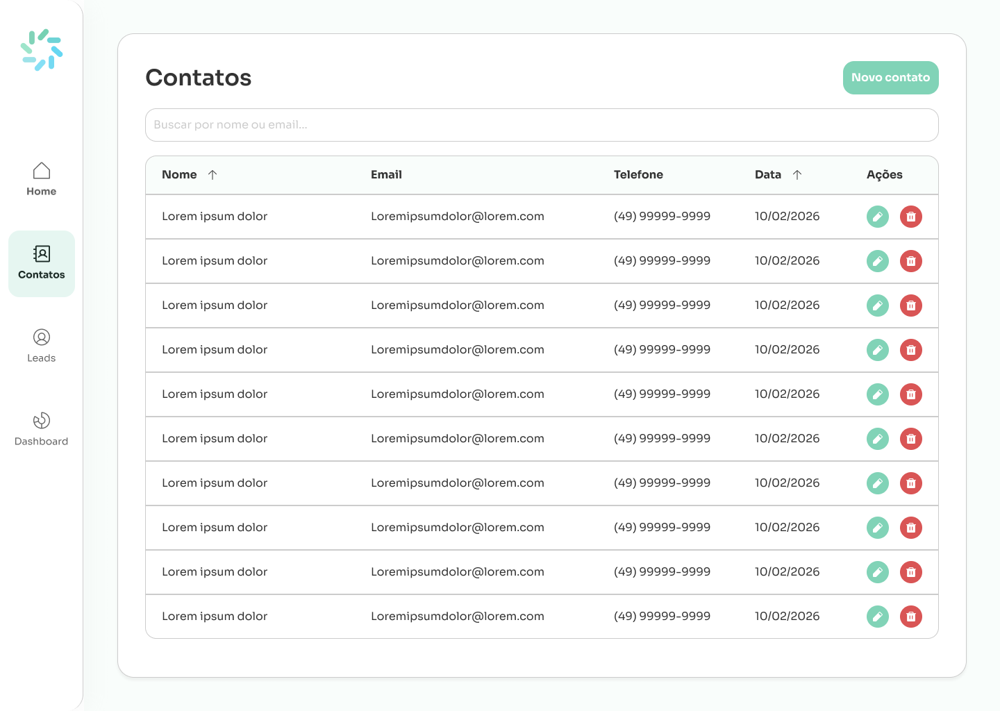
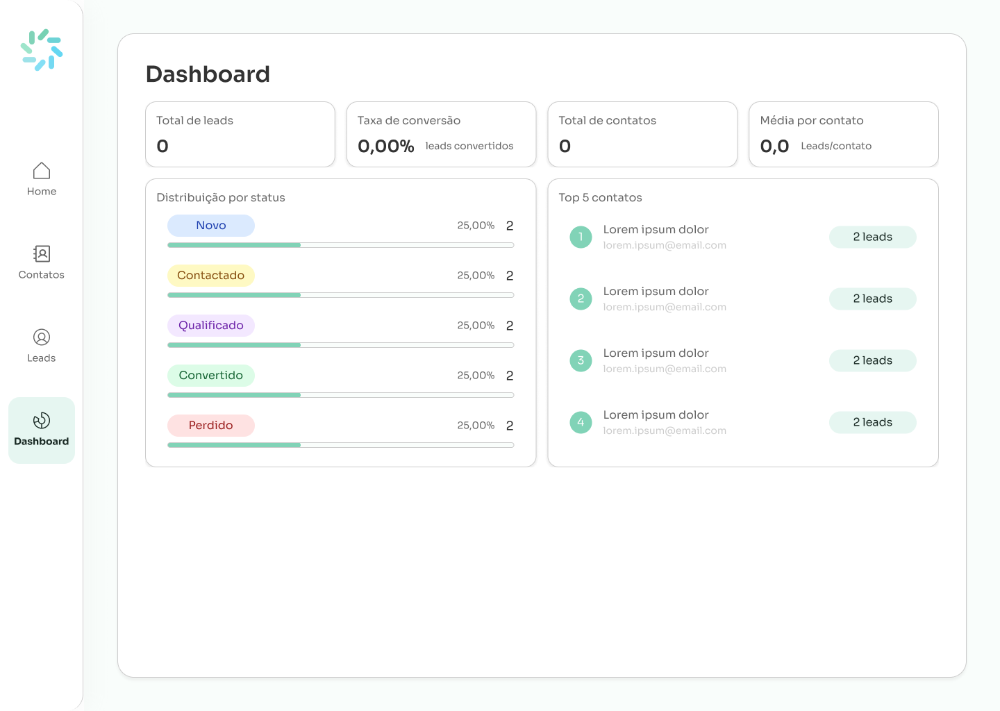

# UnoCRM - Desafio Técnico

Mini CRM de Leads desenvolvido como desafio técnico, com foco em gerenciamento de leads e contatos.

## 🎨 Protótipo das Telas

As telas foram prototipadas no Figma para definir a interface antes do desenvolvimento.

**Link do Figma:** [UnoCRM - Protótipo](https://www.figma.com/design/uPEFcKcqjMunpsAMBFtlJ4/UnoCRM?node-id=0-1&t=9SiNeDTthvn4LCdg-1)

> **Organização do Figma:**
> - **Wireframes**: Contém as telas do sistema
> - **StyleGuide**: Contém o design system do projeto

> **Nota:** As telas obrigatórias do desafio são apenas **Contatos** e **Leads** e seus cadastros. As telas **Home** e **Dashboard** foram criadas adicionalmente como um desafio pessoal.

### Telas do Sistema

#### Home

Tela inicial do sistema (tela adicional).


---

#### Contatos

Listagem de contatos cadastrados no sistema.



---

#### Cadastro de Contatos

Formulário para criação e edição de contatos.


---

#### Leads

Listagem de leads com filtros por status e busca.


---

#### Cadastro de Leads

Formulário para criação e edição de leads.


---

#### Dashboard

Painel com métricas e indicadores do sistema (tela adicional).



---

## 📋 Sobre o Desafio

Este projeto é parte de um teste técnico para desenvolvimento de uma aplicação fullstack de gerenciamento de leads e contatos.

Para mais detalhes sobre os requisitos do desafio, consulte o arquivo [README_TESTE_TECNICO.md](README_TESTE_TECNICO.md).

## 🛠️ Stack Tecnológica

- **Backend:** Hono + TypeScript + Zod
- **Frontend:** React + TypeScript
- **Persistência:** Em memória (arrays)

---

## 📦 Estrutura do Projeto

```
uno-challenge/
├── api/                    # Backend Hono
├── web/                    # Frontend React
├── Assets/                 # Imagens do protótipo
├── README.md              # Este arquivo
└── README_TESTE_TECNICO.md # Requisitos do desafio
```

---

**Desenvolvido para o desafio técnico UNO** 🚀
