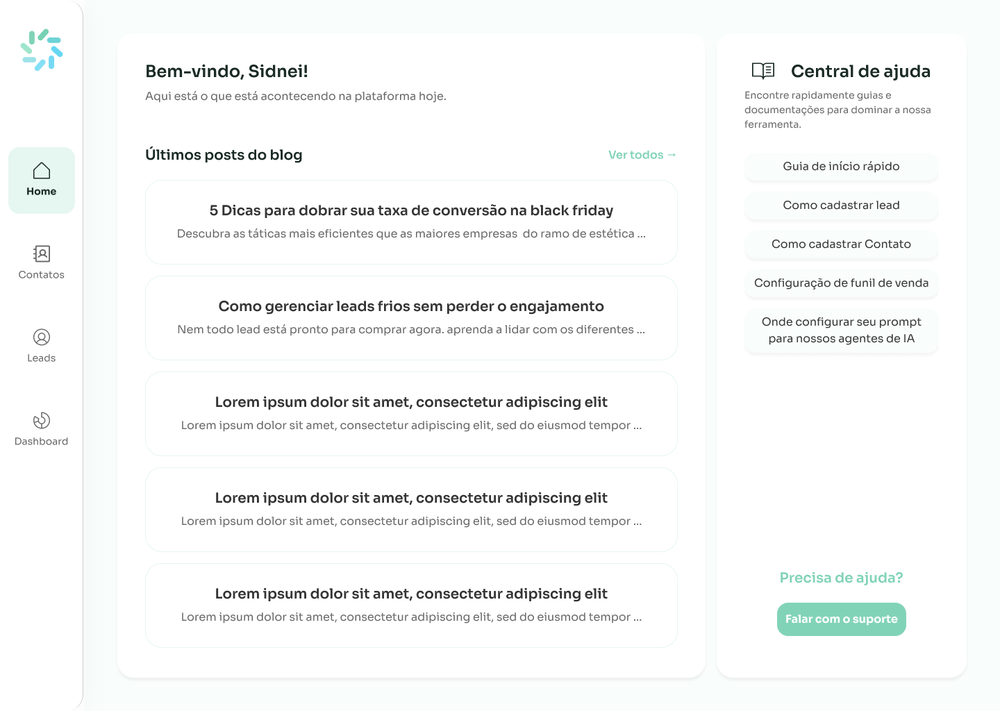
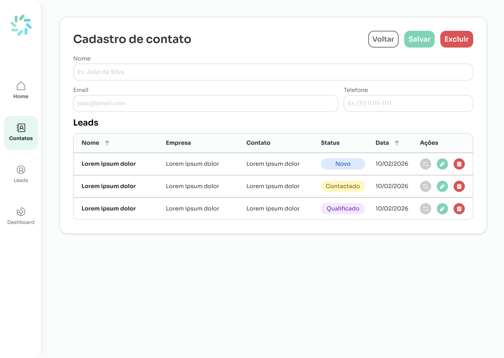
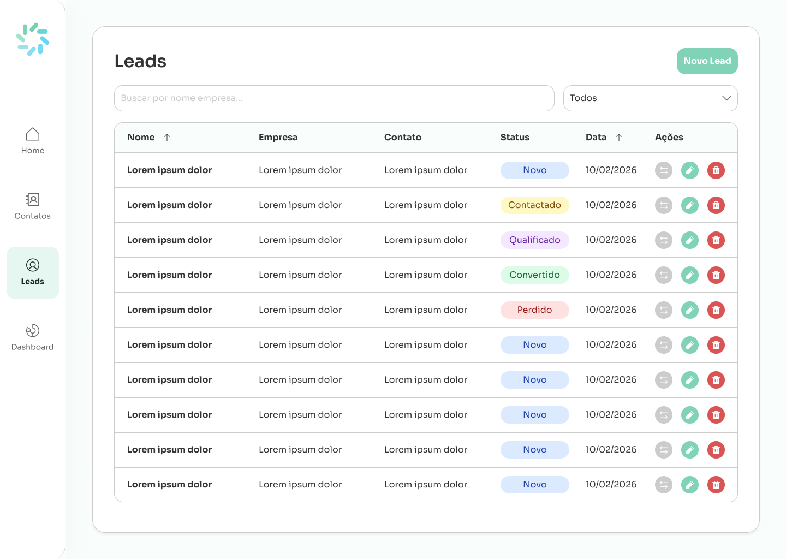
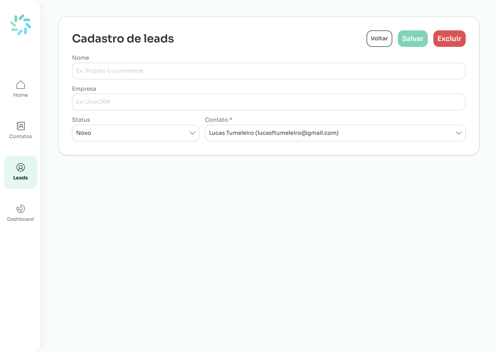

# 🎨 Frontend - UnoCRM

Interface web desenvolvida com **React** + **TypeScript** + **TailwindCSS** para gerenciamento de Leads e Contatos.

## 🎯 Sobre o Projeto

O frontend do UnoCRM foi desenvolvido seguindo o protótipo criado no Figma, com foco em proporcionar uma experiência de usuário intuitiva e moderna para o gerenciamento de leads e contatos.

A interface foi inspirada no design observado no site oficial [**UnoCRM**](https://www.unocrm.com.br/), especialmente nas imagens de funcionalidades e no vídeo de demonstração do produto. Para manter consistência visual com a identidade da marca, utilizei a mesma paleta de cores e tipografia presentes no site acima citado.

**Link do Figma:** [UnoCRM - Protótipo](https://www.figma.com/design/uPEFcKcqjMunpsAMBFtlJ4/UnoCRM?node-id=0-1&t=9SiNeDTthvn4LCdg-1)

> **Organização do Figma:**
>
> - **Wireframes**: Contém as telas do sistema
> - **StyleGuide**: Contém o design system do projeto

> **Nota:** As telas obrigatórias do desafio são apenas **Contatos** e **Leads** e seus cadastros. As telas **Home** e **Dashboard** foram criadas adicionalmente como um desafio pessoal.

---

## 📱 Telas do Sistema

### Home

Tela inicial do sistema com visão geral e acesso rápido às funcionalidades principais.



**Características:**

- Acesso rápido aos guias da central de ajuda
- Acesso rápido para a área de blog da empresa
- Acesso ao suporte técnico

---

### Contatos

Listagem completa de todos os contatos cadastrados no sistema, com recursos de busca e filtros.


**Funcionalidades:**

- Listagem de todos os contatos
- Busca por nome, email
- Ações de editar e excluir
- Botão para criar novo contato

---

### Cadastro de Contatos

Formulário intuitivo para criação e edição de contatos com validação de campos.



**Campos:**

- Nome completo
- Email
- Telefone
- Visualização e interação com os Leads vínculados
- Validações

---

### Leads

Listagem de leads com recurso de busca por nome ou empresa e filtros por status.



**Funcionalidades:**

- Listagem de todos os leads
- Filtros por status (Novo, Contato Feito, Qualificado, etc.)
- Busca por nome ou empresa
- Indicadores visuais de status
- Ações de editar e excluir

---

### Cadastro de Leads

Formulário completo para criação e edição de leads com todos os campos necessários.



**Campos:**

- Nome
- Empresa
- Status do lead
- Contato responsável

---

### Dashboard

Painel analítico com métricas e indicadores de performance do sistema.


**Métricas exibidas:**

- Total de leads por status
- Taxa de conversão
- Entre outros

---

## 🚀 Comandos

```bash
# Desenvolvimento (com hot-reload)
yarn dev

# Build para produção
yarn build

# Preview do build
yarn preview

# Executar testes
yarn test
```

## 🧪 Testes

O frontend possui testes unitários dos componentes de UI usando **Vitest** + **Testing Library**, demonstrando a vantagem do **Composition Pattern** adotado nos inputs:

### \_Internal (Base Composicional)

Os sub-componentes `Root`, `Label`, `Control` e `ErrorMessage` são a base de **todos** os inputs do sistema. Testar aqui uma vez cobre o comportamento compartilhado — renderização, estados (disabled, error, required), ref forwarding, composição.

### InputText (Componente Composto)

Testa apenas o que é **específico** do InputText: a montagem correta dos sub-componentes, `type="text"` forçado, repasse de `label`, `error` e `required`. **Não repete** o que já foi coberto no `_Internal`.

> Essa estratégia se aplica a qualquer outro input (InputEmail, InputPhone, InputSearch) — todos herdam a cobertura do `_Internal` automaticamente.

```bash
# Executar testes
yarn test
```

## 🛠️ Stack Tecnológica

- **Framework**: [React 19](https://react.dev/) - Biblioteca para interfaces
- **Linguagem**: [TypeScript](https://www.typescriptlang.org/) - Tipagem estática
- **Estilização**: [TailwindCSS 4](https://tailwindcss.com/) - Utility-first CSS
- **Build Tool**: [Vite](https://vitejs.dev/) - Build tool ultrarrápido
- **Validação**: Zod - Schema validation no cliente
- **Testes**: [Vitest](https://vitest.dev/) + [Testing Library](https://testing-library.com/) - Testes de componentes

## 📁 Estrutura de Diretórios

```
web/
├── src/
│   ├── components/
│   │   ├── _ui/              # Componentes de UI reutilizáveis
│   │   │   ├── inputs/       # Inputs (Composition Pattern)
│   │   │   │   ├── _Internal/  # Sub-componentes base (Root, Label, Control, ErrorMessage)
│   │   │   │   ├── InputText/
│   │   │   │   ├── InputEmail/
│   │   │   │   ├── InputPhone/
│   │   │   │   └── InputSearch/
│   │   │   ├── selects/
│   │   │   ├── Button/
│   │   │   ├── Badge/
│   │   │   ├── Form/
│   │   │   ├── Field/
│   │   │   ├── Modal/
│   │   │   ├── Table/
│   │   │   ├── Page/
│   │   │   ├── Pagination/
│   │   │   └── Spinner/
│   │   ├── GridSystem/
│   │   └── ConfirmDelete/
│   ├── pages/
│   │   ├── Home/
│   │   ├── Dashboard/
│   │   ├── Contacts/
│   │   └── Leads/
│   ├── Hooks/
│   ├── Layout/
│   ├── Router/
│   ├── Lib/
│   ├── common/
│   ├── Types/
│   └── test/                 # Setup de testes
├── vitest.config.ts
└── package.json
```

## 🎨 Design System

O projeto segue um design system consistente definido no Figma, incluindo:

- **Paleta de cores**: Cores primárias, secundárias e de estado
- **Tipografia**: Hierarquia de textos e tamanhos
- **Espaçamentos**: Sistema de grid e espaçamentos consistentes
- **Componentes**: Botões, inputs, cards e outros elementos padronizados
